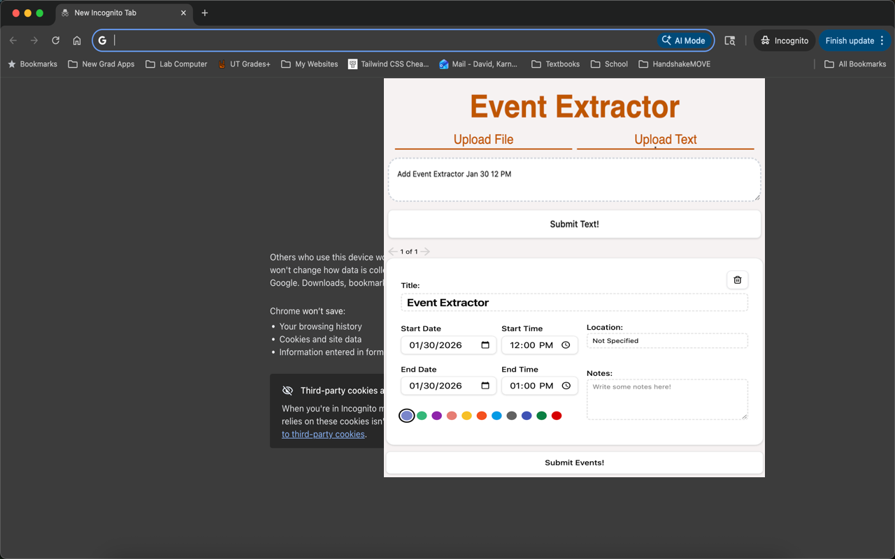

# 📅 Event Extractor

> **Stop manually copying dates from documents. Let AI do it for you.**

**Event Extractor** is a Chrome Extension that uses Google's Gemini AI to instantly sift through unstructured documents (like course syllabi or email schedules), extract event details, and sync them directly to your Google Calendar.

---

## 🎥 Demo

---

## 🚀 Download

**[Get it on the Chrome Web Store](https://chromewebstore.google.com/detail/event-extractor/dbongknaphcmabpchkclhcjhfkljmlna)**

> ⚠️ **Update Status:** This extension is currently waiting to be approved for the new 1.1.0 update with text pasting and color selection.
---

## ✨ Features

* **📄 PDF & Text Support:** Upload a PDF syllabus directly or paste raw text from emails/websites.
* **🤖 AI-Powered Extraction:** Uses Gemini to intelligently detect event titles, dates, start/end times, and locations.
* **🎨 Custom Color Coding:** Pick standard Google Calendar colors (Sage, Tomato, Lavender, etc.) for your events before uploading.
* **✏️ Review & Edit:** Nothing is uploaded automatically. Verify details via "Event Cards" to ensure accuracy.
* **🔒 Secure Authentication:** Log in safely with your Google Account. Includes support for switching accounts.
* **⚡ One-Click Sync:** Bulk upload all confirmed events to your calendar instantly.

---

## 🛠️ Tech Stack

* **Frontend:** React, Vite, TailwindCSS
* **Backend:** Express.js (hosted on Render)
* **AI Model:** Google Gemini 1.5 Flash
* **APIs:** Google Calendar API, Google Identity API

---

## 🔮 Future Implementations

We are constantly working to improve Event Extractor. Here is what is on the roadmap:

* [ ] **Account Selection:** Allow users to sign in and out of Google acounts they want to use.
* [ ] **Multiple Calendar Selection:** Allow users to choose which specific calendar (not just 'Primary') to upload events to.
* [ ] **Recurring Events:** Support for identifying and creating repeating events (e.g., "Every Tuesday at 2 PM").
* [ ] **Sifting Events:** More user-friendly support for going through multiple events.
* [ ] **Dark Mode:** Full UI support for system dark mode preferences.
* [ ] **Export to .ICS:** Option to download an `.ics` file for use with Apple Calendar or Outlook.

---

## 🚨 Current Bugs/Issues
